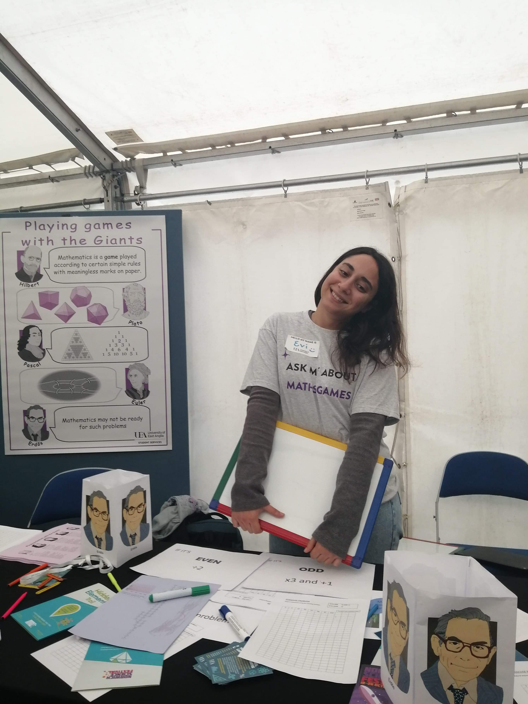
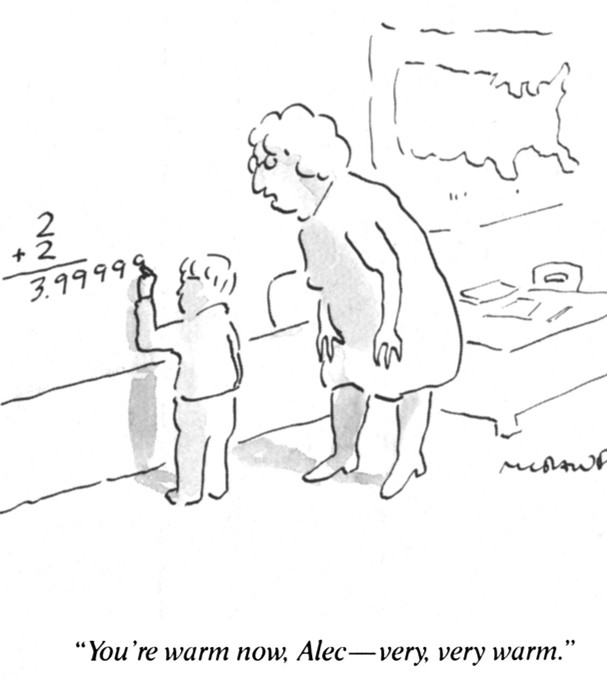
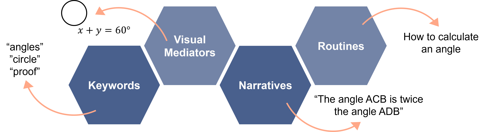
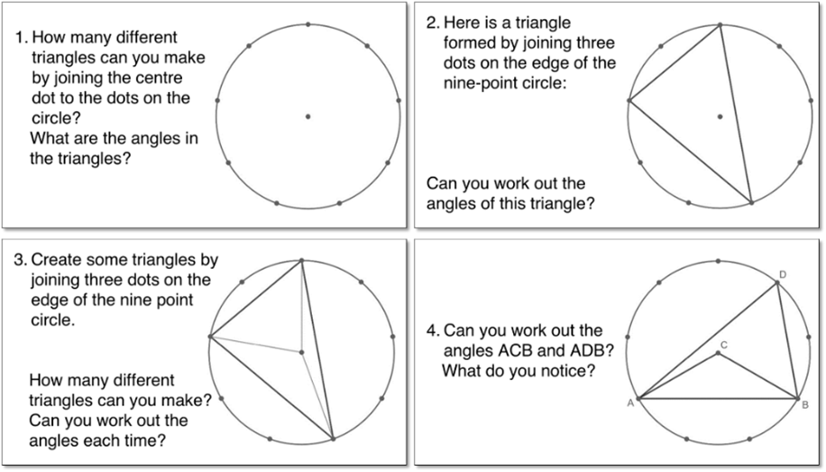
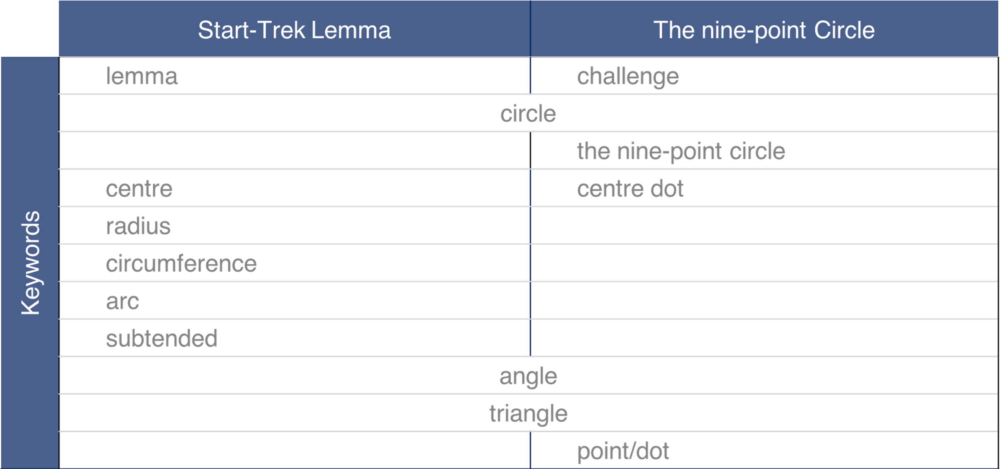
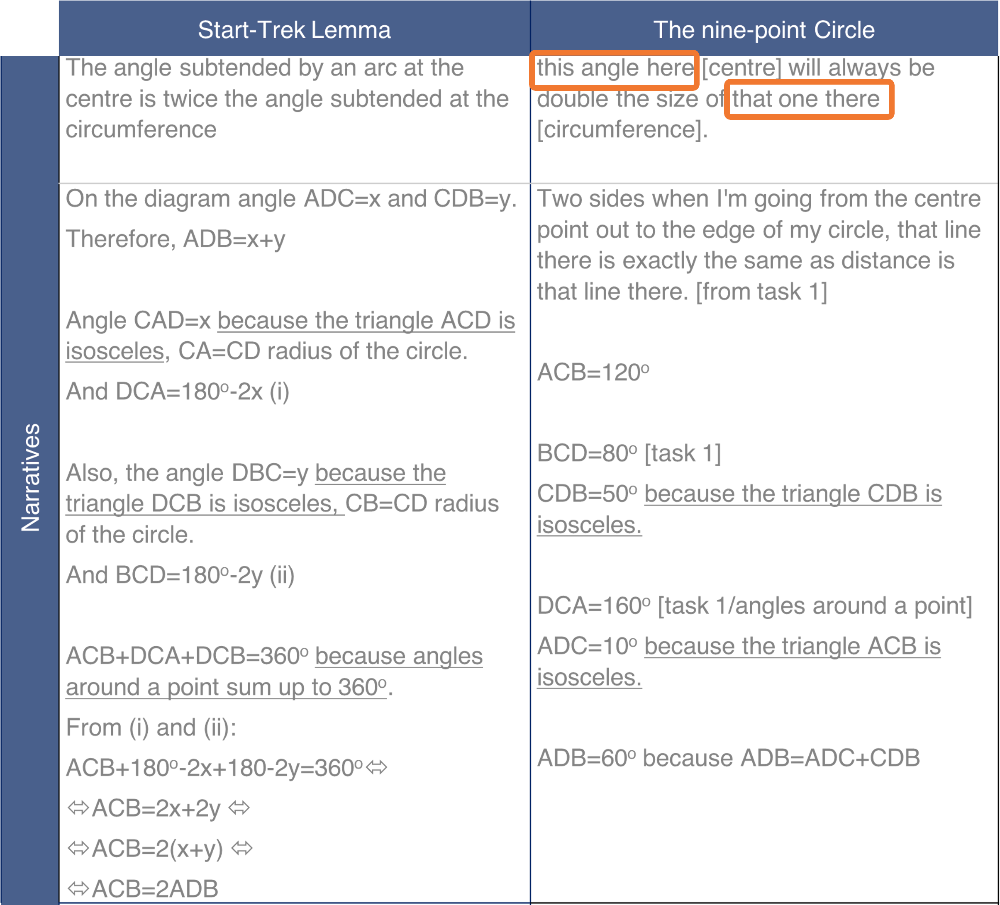
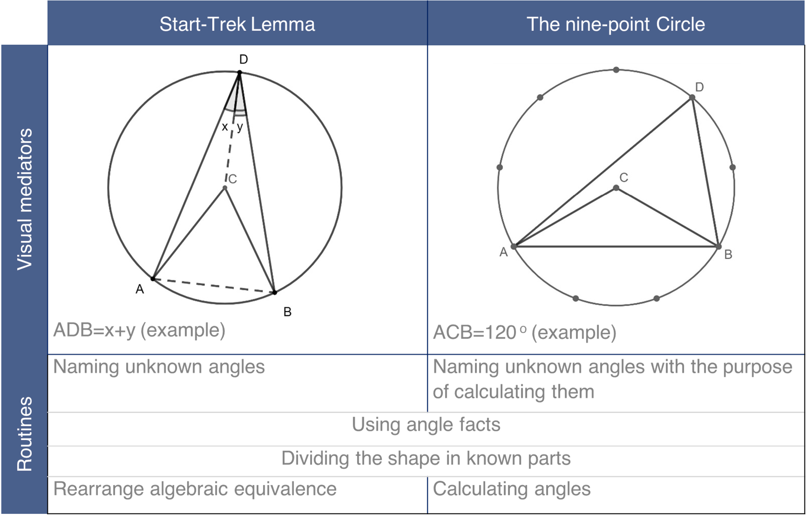
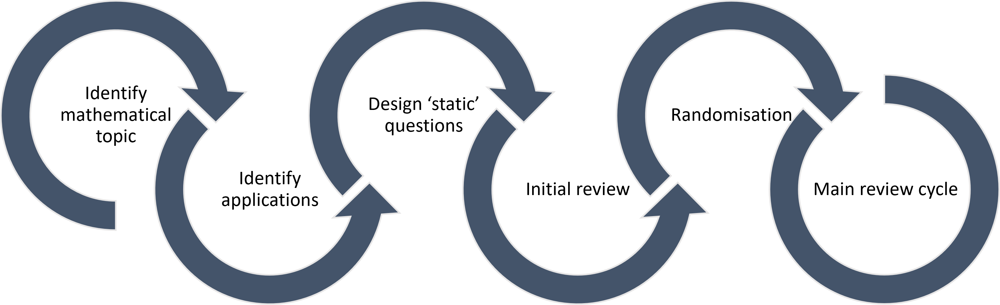

```{r}

```

## Outline of the session
- Introduction
- Theoretical Framing 
- My work
  - Discourse at the Mathematical Horizon
  - Integrating Worlds
- Scenarios for discussion and reflection
- Concluding remarks

## Evi Papadaki 
::: {.columns}
:::{.column }
**Lecturer in Mathematics Education <br> UCL Institute of Education**

{width=60% alt="A photo of me at the Norwich Science Festival"}
:::

:::{.column}

- **Background**: 
  - BSc and MSc in Mathematics
  - PhD in Mathematics Education
  - Mathematics and Statistics support in HE
  - A level further Maths teacher 

:::{.incremental}
- **Research interests**: Advanced Mathematics in Teaching; Boundary Crossing; Digital accessibility for Mathematics
:::
:::{.incremental}
- **Currently teaching**: PGCE Mathematics, MA in Mathematics Education, and TUMIPS
:::

:::

::: 


## Introduction

:::{.columns}

:::{.column}

**Knowledge at the mathematical horizon**: Awareness of the broader mathematical landscape in which teaching is situated (Ball & Bass, 2009)

<br>

> “the larger significance of what may be only partially revealed in the mathematics of the moment” 
(Ball & Bass, 2009, p. 6)


<br>

:::{.incremental}

What does it take to facilitate meaningful discussion ***beyond the mathematics of the moment*** at different ages?
:::

:::

:::{.column}

{width=80%}

:::

:::

:::{.notes}
Are there opportunities for discussions beyond the mathematics of the moment? If so, how do they look and what does it take to facilitate meaningful discussion at different ages.
:::

## Commognition (Sfard, 2008)
- **Mathematics is a Discourse** characterised by the following four elements:

{.lightbox}

- **Learning**: A change in the learners discourse
- **Teaching**: a communicational activity aiming to bring the learners discourse closer to a canon discourse (Tabach & Nachlieli, 2016) 


:::{.notes}
Before I present my work, I need to define what I consider knowledge.
- **Mathematics is a Discourse** characterised by the following four elements:
  - **Word use** (e.g., the use of the word 'show'or 'proof')
  - **Visual Mediators** (e.g., $x+y=60 ^{\circ}$, a circle etc)
  - **Narratives** (e.g., "The angle ACB is twice the angle ADB", a theorem, a written proof etc )
  - **Routines** (a task followed by a procedure)
- **Learning**: A change in the learners discoursive practices
- **Teaching**: practices aiming to bring the learners discourse closer to a canon discourse (Tabach & Nachlieli, 2016) 
:::

## Boundary Crossing (Akkerman & Bakker, 2011)

:::{.incremental}

- **Boundary**: A sociocultural difference that leads to a discontinuity in action or interaction. 
- **Boundary Crossing**: The transitions and interactions of individuals as they move across different social and cultural practices.
- **Boundary Objects**: Artifacts that serve as a bridge between individuals or communities.
- **Intersubjectivity**: “an action that makes sense from the perspective of two discourses – the learner’s and the expert’s – which may be incommensurable” (Cooper & Lavie, 2021, p. 8–9)
:::

## Learning occurs at boundaries

:::{.incremental}

Akkerman and Bakker (2011) identify 4 learning mechanisms of boundaries:

- **Identification**: Coming to know what the diverse practices are about in relation to one another.
- **Coordination**: Creating cooperative, routine exchanges between practices.
- **Reflection**: Expanding one's perspectives on the practices.
- **Transformation**: Collaborative co-development of new, hybrid practices or "third spaces" triggered by a shared problem.

:::

:::{.notes}
At INDRUM (International Network for Didactic Research in University Mathematics) 2024: Boundary crossing was identified as an important future direction for solving epistemological issues between mathematical and other disciplines and their impact on teaching. 
:::

## Discourse at the Mathematical Horizon: Motivation

- Definitions of Knowledge at the Mathematical Horizon are:
  - varied and sometimes inconsistent  
  - often metaphorical  
  - weakly connected to classroom practice  

- **Aim:** Re-examine the idea through a discourse perspective.

## Discourse at the Mathematical Horizon: Methodology 

- **Qualitative study:**

  - Lesson observations of 3 teachers  
  - Semi-structured interviews  with 11 teachers and teacher educators
  - The participants are in different stages of their careers and from a range of mathematical and social backgrounds

- **Analysis:**
  - episodes offering opportunities for discussion beyond the mathematics of the moment 
  - the teachers' mathematical and pedagogical discourses framing these episodes.

## Discourse at the Mathematical Horizon: Key Findings 

:::{.columns}

:::{.incremental}

:::{.column}
- Four types of opportunities to go *beyond the mathematics of the moment*:

  1. Ideas across the curriculum  
  2. What comes next  
  3. Mathematical conventions  
  4. Applications in disciplines and professions  
:::

:::{.column}
- A teacher's Discourse at the Mathematical Horizon can be thought of as a 'hybrid' awareness, influenced by:
  
  - Formal and Informal Learning
  - Personal life experiences 
  - Pedagogical views
:::
:::
:::


## Communication Across Discourses 

{.lightbox}

:::{.notes}

Successful “beyond the mathematics of the moment” teaching depended on:

- shared meaning between teacher and students  
- accessible language and representations  
- classroom conditions  
- pedagogical stance  
:::

## Shared meaning between Liz and her students
{.lightbox}

## Shared meaning between Liz and her students

{width=50% .lightbox}

## Shared meaning between Liz and her students
{width=80% .lightbox}

:::{.notes} 
Successful “beyond the moment” teaching depended on:

- shared meaning between teacher and students  
- accessible language and representations  
- classroom conditions  
- pedagogical stance  

The activity and the nine point circle act as a bridge between discourses.

:::

## Hybrid Mathematical–Pedagogical Awareness through life experiences

**Damian**:"[I]t's a kind of hybrid of awarenesses (sic) from both the mathematician and the teacher [...] if you say four eighth ($\frac{4}{8}$) is the same as one half ($\frac{1}{2}$), then you're obviously lying to a child and the child can see that because one the symbol is it just completely different. They're not, they're not the same symbols [laughs]"

<br><br>

"[...] anyone who says that they are the same has developed an awareness a sort of, they, they can see that as an equivalence class, they see four eights, and they see it's, it's one half straight away. And so, they have this, they made, they probably haven't ever heard, well, you know, most, lots of people can come to fractions and have never heard of equivalence classes, but they think of them as being the same."

:::{.notes}

Teachers integrate:

- mathematical insight  
- knowledge of learners  
- pedagogical intentions  

Example: Equivalent fractions seen as both

- equal quantities (mathematical view)
- different representations (student perspective)

A hybrid awareness emerges.

:::

## Redefining Horizon Discourse

**Discourse at the Mathematical Horizon**

> A meta-discourse of advanced mathematics whose communication patterns acquire pedagogical meaning and support intersubjective narratives beyond the mathematics of the moment.

- is a deliberate professional practice.
- involves crossing boundaries between:

  - curriculum ↔ advanced mathematics and its applications 
  - mathematics ↔ pedagogy  
  - teacher ↔ student discourse  
  - formal ↔ informal learning settings  

:::{.notes}

- Teachers actively construct connections beyond the curriculum  
- Such moments are opportunities, not deviations  
- Professional development could support this practice  
- Relevant for school–university transitions  
:::

## Integrating Worlds: Motivation
- In collaboration with Tamsin Smith, Susan Crennell, and Waleed Ali
- Diverse entry pathways to university degrees result in varied student mathematical backgrounds (Hodgen et al., 2018).
- Students are expected to develop mathematical and data analysis knowledge and skills “sufficient to support subject understanding and problem solving” (Society for Natural Sciences, 2021, p. 12).

- **Aim:** Design contextualised NUMBAS questions to support students' mathematical learning in Natural Sciences.

:::{.notes}

- The Natural Sciences course at the University of Bath offers various pathways for students to choose from.
- Admission does not require A-level Mathematics or equivalent. 
- Mathematics provision is aimed at ensuring equitable opportunities and support for all students, fostering their academic aspirations while mitigating disparities in workload and preparation.
- The learning of this diverse cohort is supported by using NUMBAS, a   web-based system for creating dynamic assessment questions.

:::


## Integrating Worlds: Methodology 

{.lightbox}

- *What are the anticipated benefits and limitations of using contextualised NUMBAS questions to identify and support Natural Sciences students' mathematical needs?*

- An a priori analysis of 20 contextualised NUMBAS questions.

## Integrating Worlds: Key Findings{.smaller}

{.lightbox}


## Implications for practice

- The design offers opportunities: 
  - level the ground for students with diverse mathematical backgrounds,
  - enrich their learning experience, and
  - impact their future scientific endeavours that require mathematics.
  
- Our collaboration enabled boundary crossing that shaped the question design.

## Time for discussion: Scenarios

- Scenarios[^1] describing a situation that requires expertise from more than one disciplines. 
- **Aim:** Identify how the collaboration could produce new possibilities for *teaching*, *learning*, or *research*.
  - Discuss in small groups
  - Identify **disciplinary differences** and **communication challenges**
  - Consider **opportunities for professional learning** through the situation
  - Propose **strategies for productive collaboration**
  
[^1]: **Disclaimer:** All scenarios inspired by my experience, all characters and situations are fictional.

:::{.notes}
Each scenario describes a situation where expertise from one discipline alone is insufficient. Your task is not to solve the problem, but to identify how collaboration across practices could produce new possibilities for teaching, learning, or research.
:::

## S1. Linear Algebra for Physics Students
- A physics lecturer teaches Linear Algebra to first‑year students.
- Many students encounter the ideas for the first time.
- The lecturer wants to balance *rigor and definitions* with *intuition and relevant applications*
- The lecturer asks a Mathematician for help.
- Their task is to design a module that supports physics students.

## S2. Interdisciplinary Data Skills Module
- The school proposes a new data literacy module for biology, chemistry and environmental science students.
- A group of two Statisticians, a Computer Scientist and a Biologist are invited to collaboratively design this course. 
- Their task is to design a coherent module serving all three disciplines.

## S3. School to University transition
- Teaching staff often report first‑year students struggle with expectations.
- A group of University staff (academics, Library staff and support services) secured funding to support a collaboration with school teachers.
- During this process different assumptions about preparation and learning emerge.
- Their task is to develop resources for A level and 1st year University students.

## S4. Cross-disciplinary Degree programme <br> (if time allows)
- A new programme addressing global challenges is being designed.
- Engineering, mathematics, social sciences, and environmental science involved.
- Conflicting epistemologies and assessment traditions emerge.
- Their task is to design a coherent interdisciplinary curriculum.

## Concluding remarks

- What boundary‑crossing opportunities exist in our own practice?
- What barriers might we face?
- What small step could we take towards our goal?

### Here's mine
- Develop resources for raising awareness across mathematics teacher digital accessibility in maths.
- Support student-teachers to development of Discourse at the Mathematical Horizon.


## Thank you and thanks to
:::{.columns}

:::{.column}
Waleed Ali

Irene Biza

Ilaria Bussoli

Emma Cliffe

Susan Crennell

Thomas Cottrell

Laura Francis

Jonny Griffiths

Ruth Hand

Samantha Hayward

:::

:::{.column}

Christos Kourouniotis

Ben McGovern

Elena Nardi

Tim Rowland

Cathy Smith

Tamsin Smith

Ed Southwood

Athina Thoma

all my students and more...

:::

:::

## References{.smaller}

::: {.references}

Akkerman, S. F., & Bakker, A. (2011). Boundary crossing and boundary objects. *Review of Educational Research, 81*(2), 132–169. [https://doi.org/10.3102/0034654311404435](https://doi.org/10.3102/0034654311404435)

Ball, D. L., & Bass, H. (2009). With an eye on the mathematical horizon: Knowing matematics for teaching to learners’ mathematical futures. Paper prepared based on keynote address at the 43rd Jahrestagung fuer Didaktik der Mathematik held in Oldenburg, Germany, March 1–4, 2009.

Cooper, J., & Lavie, I. (2021). Bridging incommensurable discourses – A commognitive look at instructional design in the zone of proximal development. *The Journal of Mathematical Behavior, 61*, 100822. [https://doi.org/10.1016/j.jmathb.2020.100822](https://doi.org/10.1016/j.jmathb.2020.100822)

Hodgen, J., Adkins, M., & Tomei, A. (2018). The mathematical backgrounds of undergraduates from England. *Teaching Mathematics and Its Applications, 39*(1), 38–60 . 
[https://doi.org/10.1093/teamat/hry017](https://doi.org/10.1093/teamat/hry017)

Society for Natural Sciences (2021). *Society for Natural Sciences Degree Accreditation Handbook*. [https://www.socnatsci.org/wp-content/uploads/2021/05/Accrediation-Handbook-May-2021.pdf](https://www.socnatsci.org/wp-content/uploads/2021/05/Accrediation-Handbook-May-2021.pdf)

Sfard, A. (2008). *Thinking as communicating: Human development, the growth of discourses, and mathematizing*. Cambridge University Press.

Tabach, M., & Nachlieli, T. (2016). Communicational perspectives on learning and teaching mathematics: Prologue. *Educational Studies in Mathematics, 91*(3), 299–306.

:::

## Appendix: Interactive Numbas question

### *Separable Differential Equations - Radioactive Decay*

```{=html}
<iframe width="100%" height="630" data-src="https://numbas.mathcentre.ac.uk/question/125558/integration-solving-separable-differential-equations-radioactive-decay/embed/" data-preload title="Numbas"></iframe>
```
